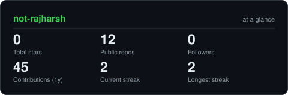
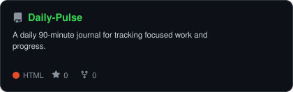
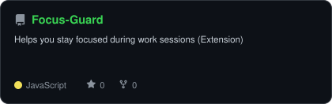
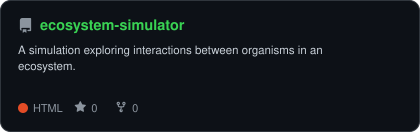
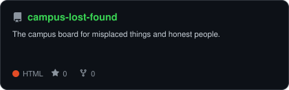

<div align="center">

<!-- PORTRAIT - generated by scripts/dotify.py from assets/jacket.png -->

<p align="center">
  <a href="https://ishan-oshada.vercel.app/">
    
  </a>
</p>

<!-- NAME / TAGLINE - animated typing -->

<a href="https://github.com/not-rajharsh">
  
</a>

<br>

<!-- SOCIALS -->

<a href="https://www.linkedin.com/in/harsh-raj-294364326/"></a> <a href="mailto:notrajharsh@gmail.com"></a> <a href="https://leetcode.com/u/raj_harsh04"></a>


</div>

---

## `~/` whoami

```console
$ cat about.txt
```

Hi, I'm **Harsh Raj**, a Computer Science student who enjoys building practical projects, exploring cybersecurity, and using AI to turn ideas and problems into working solutions.

* 🎓 Currently pursuing **BSc (Hons.) Computer Science**
* 🔐 Exploring **Cybersecurity**
* 🤖 Interested in **AI/ML & AI-assisted problem solving**
* 🧠 Currently learning **C++, Git, Cybersecurity & Blockchain**
* 🛠️ I enjoy building projects that solve real-world problems
* ⚡ I like experimenting, breaking things, and figuring out how they work

<br>

<div align="center">

## `~/` toolbox


</div>

---

<div align="center">

## `~/` skill radar

<table>
<tr>

<td width="50%" align="center" valign="middle">

<!-- Self-rated radar - edit assets/skills.json, the workflow redraws it -->

<picture>
  <source media="(prefers-color-scheme: dark)" srcset="assets/radar-dark.svg">
  <source media="(prefers-color-scheme: light)" srcset="assets/radar-light.svg">
  
</picture>

</td>

<td width="50%" align="center" valign="middle">

<!-- Live radar built from real language byte counts across your repos -->

<picture>
  <source media="(prefers-color-scheme: dark)" srcset="assets/radar-langs-dark.svg">
  <source media="(prefers-color-scheme: light)" srcset="assets/radar-langs-light.svg">
  
</picture>

</td>

</tr>
</table>

</div>

---

<div align="center">

## `~/` contribution calendar

<!-- 3D isometric calendar, regenerated every 6h by .github/workflows/metrics.yml -->


<br><br>

<!-- Snake eats the contribution graph - .github/workflows/snake.yml -->
<picture>
  <source media="(prefers-color-scheme: dark)"  srcset="https://raw.githubusercontent.com/not-rajharsh/not-rajharsh/output/snake-dark.svg">
  <source media="(prefers-color-scheme: light)" srcset="https://raw.githubusercontent.com/not-rajharsh/not-rajharsh/output/snake.svg">
  
</picture>

</div>

---

<div align="center">

## `~/` the numbers

<!-- Generated by scripts/cards.py into this repo -->

<picture>
  <source media="(prefers-color-scheme: dark)" srcset="assets/card-stats-dark.svg">
  <source media="(prefers-color-scheme: light)" srcset="assets/card-stats-light.svg">
  
</picture>

<br>


<br><br>


</div>

---

<div align="center">

## `~/` selected work

<!-- Cards generated by scripts/cards.py from assets/projects.json -->

<table>

<tr>

<td width="50%">
  <a href="https://github.com/not-rajharsh/Daily-Pulse">
    <picture>
      <source media="(prefers-color-scheme: dark)" srcset="assets/card-Daily-Pulse-dark.svg">
      <source media="(prefers-color-scheme: light)" srcset="assets/card-Daily-Pulse-light.svg">
      
    </picture>
  </a>
</td>

</tr>

<tr>

<td width="50%">
  <a href="https://github.com/not-rajharsh/Focus-Guard">
    <picture>
      <source media="(prefers-color-scheme: dark)" srcset="assets/card-Focus-Guard-dark.svg">
      <source media="(prefers-color-scheme: light)" srcset="assets/card-Focus-Guard-light.svg">
      
    </picture>
  </a>
</td>

<td width="50%">
  <a href="https://github.com/not-rajharsh/BlockyTerrain">
    <picture>
      <source media="(prefers-color-scheme: dark)" srcset="assets/card-BlockyTerrain-dark.svg">
      <source media="(prefers-color-scheme: light)" srcset="assets/card-BlockyTerrain-light.svg">
      
    </picture>
  </a>
</td>

</tr>

<tr>

<td width="50%">
  <a href="https://github.com/not-rajharsh/ecosystem-simulator">
    <picture>
      <source media="(prefers-color-scheme: dark)" srcset="assets/card-ecosystem-simulator-dark.svg">
      <source media="(prefers-color-scheme: light)" srcset="assets/card-ecosystem-simulator-light.svg">
      
    </picture>
  </a>
</td>

<td width="50%">
  <a href="https://github.com/not-rajharsh/campus-lost-found">
    <picture>
      <source media="(prefers-color-scheme: dark)" srcset="assets/card-campus-lost-found-dark.svg">
      <source media="(prefers-color-scheme: light)" srcset="assets/card-campus-lost-found-light.svg">
      
    </picture>
  </a>
</td>


---

<div align="center">

<sub>`01110100 01101000 01100001 01101110 01101011 01110011 00100000 01100110 01101111 01110010 00100000 01110011 01100011 01110010 01101111 01101100 01101100 01101001 01101110 01100111`</sub>

</div>
